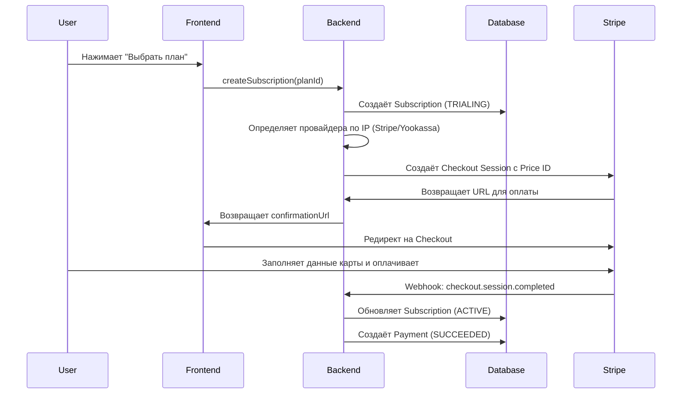

# 🎯 Stripe Setup Guide - Пошаговая Настройка

**Версия:** 1.0
**Дата:** 2025-12-28
**Для проекта:** ProRab Space

---

## 📋 Что мы настраиваем

В ProRab Space есть 3 тарифных плана:

| План | Название | Цена (RUB) | Цена (USD) | Цена (EUR) |
|------|----------|------------|------------|------------|
| **LITE** | Лайт | 490₽ (290₽ early bird) | $7 ($4 early bird) | €7 (€4 early bird) |
| **FOREMAN** | Прораб ⭐ | 990₽ (690₽ early bird) | $15 ($10 early bird) | €15 (€10 early bird) |
| **BRIGADE** | Бригада | 1990₽ (1490₽ early bird) | $25 ($20 early bird) | €25 (€20 early bird) |

**Особенности:**
- Все планы имеют **месячную подписку** (30 дней)
- Действует **Early Bird** ценообразование (скидка для первых пользователей)
- Поддержка 3 валют: RUB (рубли), USD (доллары), EUR (евро)

---

## 🚀 Шаг 1: Создание Аккаунта Stripe

### 1.1. Регистрация

1. Перейдите на [https://stripe.com](https://stripe.com)
2. Нажмите **"Start now"** или **"Sign up"**
3. Заполните форму регистрации:
   - Email
   - Full name
   - Country: **Russia** (или ваша страна)
   - Password
4. Подтвердите email

### 1.2. Активация тестового режима

После регистрации вы автоматически попадете в **Test Mode** (тестовый режим).

**Как проверить:**
- В левом верхнем углу должна быть надпись **"Test mode"**
- Переключатель **"Test mode"** должен быть включен

---

## 🔑 Шаг 2: Получение API Ключей

### 2.1. Найти API ключи

1. В Dashboard Stripe нажмите на иконку **"Developers"** (левое меню)
2. Выберите **"API keys"**
3. Вы увидите 2 типа ключей:

**Publishable key (публичный ключ):**
```
pk_test_51...
```
- Используется в frontend (НЕ секретный)
- Можно показывать в коде

**Secret key (секретный ключ):**
```
sk_test_51...
```
- **СЕКРЕТНЫЙ!** Используется только в backend
- Никогда не показывайте в коде или клиенте

### 2.2. Скопировать Secret Key

1. Найдите **"Secret key"** в разделе "Standard keys"
2. Нажмите **"Reveal test key"**
3. Скопируйте ключ (начинается с `sk_test_`)
4. **ВАЖНО:** Сохраните его - он понадобится для `.env`

### 2.3. Создать Webhook Secret (для webhooks)

1. В меню "Developers" выберите **"Webhooks"**
2. Нажмите **"Add endpoint"**
3. В поле **"Endpoint URL"** введите:
   ```
   https://ваш-домен.com/api/webhooks/stripe
   ```
   Для локальной разработки:
   ```
   http://localhost:4000/webhooks/stripe
   ```
4. В **"Events to send"** выберите:
   - `checkout.session.completed`
   - `payment_intent.succeeded`
   - `payment_intent.payment_failed`
   - `customer.subscription.updated`
   - `customer.subscription.deleted`
5. Нажмите **"Add endpoint"**
6. Скопируйте **"Signing secret"** (начинается с `whsec_`)

---

## 💳 Шаг 3: Создание Products и Prices в Stripe

Теперь создадим 3 продукта (по одному на каждый план) с ценами в разных валютах.

### 3.1. План LITE (Лайт)

#### Создание продукта:

1. В Dashboard перейдите в **"Products"** → **"Add product"**
2. Заполните:
   - **Name:** `ProRab LITE`
   - **Description:** `Базовый тариф для небольших проектов и индивидуальных предпринимателей`
   - **Image:** (опционально) загрузите логотип
3. **Pricing:**
   - **Pricing model:** `Recurring` (повторяющийся)
   - **Billing period:** `Monthly` (ежемесячно)

#### Цены для LITE:

**Создайте 6 цен для этого продукта:**

**1. RUB - Обычная цена:**
- Currency: `RUB` (Russian Ruble)
- Price: `490`
- Nickname: `lite-rub-regular`

**2. RUB - Early Bird:**
- Currency: `RUB`
- Price: `290`
- Nickname: `lite-rub-earlybird`

**3. USD - Обычная:**
- Currency: `USD`
- Price: `7`
- Nickname: `lite-usd-regular`

**4. USD - Early Bird:**
- Currency: `USD`
- Price: `4`
- Nickname: `lite-usd-earlybird`

**5. EUR - Обычная:**
- Currency: `EUR`
- Price: `7`
- Nickname: `lite-eur-regular`

**6. EUR - Early Bird:**
- Currency: `EUR`
- Price: `4`
- Nickname: `lite-eur-earlybird`

4. Нажмите **"Save product"**
5. **ВАЖНО:** Скопируйте **Price ID** каждой цены (начинается с `price_...`)

**Запишите Price IDs:**
```
LITE_RUB_REGULAR=price_...
LITE_RUB_EARLYBIRD=price_...
LITE_USD_REGULAR=price_...
LITE_USD_EARLYBIRD=price_...
LITE_EUR_REGULAR=price_...
LITE_EUR_EARLYBIRD=price_...
```

---

### 3.2. План FOREMAN (Прораб) ⭐ Самый популярный

Повторите те же шаги для плана FOREMAN:

**Product:**
- **Name:** `ProRab FOREMAN`
- **Description:** `Оптимальный тариф для бригадиров и небольших строительных бригад`

**Prices:**

| Валюта | Обычная цена | Early Bird | Nickname |
|--------|--------------|------------|----------|
| RUB | 990 | 690 | `foreman-rub-regular` / `foreman-rub-earlybird` |
| USD | 15 | 10 | `foreman-usd-regular` / `foreman-usd-earlybird` |
| EUR | 15 | 10 | `foreman-eur-regular` / `foreman-eur-earlybird` |

**Запишите Price IDs:**
```
FOREMAN_RUB_REGULAR=price_...
FOREMAN_RUB_EARLYBIRD=price_...
FOREMAN_USD_REGULAR=price_...
FOREMAN_USD_EARLYBIRD=price_...
FOREMAN_EUR_REGULAR=price_...
FOREMAN_EUR_EARLYBIRD=price_...
```

---

### 3.3. План BRIGADE (Бригада)

**Product:**
- **Name:** `ProRab BRIGADE`
- **Description:** `Профессиональный тариф для крупных бригад и строительных компаний`

**Prices:**

| Валюта | Обычная цена | Early Bird | Nickname |
|--------|--------------|------------|----------|
| RUB | 1990 | 1490 | `brigade-rub-regular` / `brigade-rub-earlybird` |
| USD | 25 | 20 | `brigade-usd-regular` / `brigade-usd-earlybird` |
| EUR | 25 | 20 | `brigade-eur-regular` / `brigade-eur-earlybird` |

**Запишите Price IDs:**
```
BRIGADE_RUB_REGULAR=price_...
BRIGADE_RUB_EARLYBIRD=price_...
BRIGADE_USD_REGULAR=price_...
BRIGADE_USD_EARLYBIRD=price_...
BRIGADE_EUR_REGULAR=price_...
BRIGADE_EUR_EARLYBIRD=price_...
```

---

## 🔧 Шаг 4: Настройка Environment Variables

### 4.1. Базовые ключи

Откройте файл `apps/api/.env` и добавьте:

```env
# ==================== STRIPE CONFIGURATION ====================

# API Keys (Test Mode)
STRIPE_SECRET_KEY=sk_test_51...  # Ваш Secret Key из шага 2.2
STRIPE_WEBHOOK_SECRET=whsec_...  # Ваш Webhook Secret из шага 2.3

# ==================== STRIPE PRICE IDs ====================
# Используются для создания Checkout Sessions

# LITE Plan
STRIPE_PRICE_LITE_RUB_REGULAR=price_...
STRIPE_PRICE_LITE_RUB_EARLYBIRD=price_...
STRIPE_PRICE_LITE_USD_REGULAR=price_...
STRIPE_PRICE_LITE_USD_EARLYBIRD=price_...
STRIPE_PRICE_LITE_EUR_REGULAR=price_...
STRIPE_PRICE_LITE_EUR_EARLYBIRD=price_...

# FOREMAN Plan
STRIPE_PRICE_FOREMAN_RUB_REGULAR=price_...
STRIPE_PRICE_FOREMAN_RUB_EARLYBIRD=price_...
STRIPE_PRICE_FOREMAN_USD_REGULAR=price_...
STRIPE_PRICE_FOREMAN_USD_EARLYBIRD=price_...
STRIPE_PRICE_FOREMAN_EUR_REGULAR=price_...
STRIPE_PRICE_FOREMAN_EUR_EARLYBIRD=price_...

# BRIGADE Plan
STRIPE_PRICE_BRIGADE_RUB_REGULAR=price_...
STRIPE_PRICE_BRIGADE_RUB_EARLYBIRD=price_...
STRIPE_PRICE_BRIGADE_USD_REGULAR=price_...
STRIPE_PRICE_BRIGADE_USD_EARLYBIRD=price_...
STRIPE_PRICE_BRIGADE_EUR_REGULAR=price_...
STRIPE_PRICE_BRIGADE_EUR_EARLYBIRD=price_...
```

### 4.2. Проверка конфигурации

После добавления переменных:

```bash
cd apps/api
pnpm dev
```

В консоли должно появиться:
```
Stripe provider initialized successfully from environment variables
```

---

## 🧪 Шаг 5: Тестирование

### 5.1. Локальное тестирование

1. Запустите приложение:
   ```bash
   # Terminal 1
   cd apps/api && pnpm dev

   # Terminal 2
   cd apps/web && pnpm dev
   ```

2. Откройте `http://localhost:3000`
3. Перейдите в **Settings → Subscriptions**
4. Нажмите **"Выбрать план"** на любом плане
5. Должен открыться Stripe Checkout

### 5.2. Тестовые карты Stripe

Используйте эти карты для тестирования:

**Успешная оплата:**
```
Card number: 4242 4242 4242 4242
Expiry: 12/34 (любая будущая дата)
CVC: 123 (любые 3 цифры)
ZIP: 12345 (любой)
```

**Отклоненная карта:**
```
Card number: 4000 0000 0000 0002
```

**3D Secure (требует подтверждения):**
```
Card number: 4000 0025 0000 3155
```

### 5.3. Проверка webhooks (локально)

Для локального тестирования webhooks используйте Stripe CLI:

```bash
# Установка Stripe CLI (Windows)
# Скачайте с https://github.com/stripe/stripe-cli/releases

# Логин
stripe login

# Переадресация webhooks
stripe listen --forward-to localhost:4000/webhooks/stripe
```

В консоли появится временный webhook secret:
```
whsec_...
```

Замените `STRIPE_WEBHOOK_SECRET` в `.env` на этот ключ для локальной разработки.

---

## 🗺️ Шаг 6: Как Работает Интеграция

### 6.1. Схема создания подписки



### 6.2. Маппинг планов

**В нашей системе:**
- План: `lite` (slug) → `LITE` (enum)
- Цена: RUB, USD, EUR
- Early Bird: да/нет

**В Stripe:**
- Product: `ProRab LITE`
- Price ID: `price_...` (отдельный для каждой валюты + early bird)

**Как система выбирает Price ID:**

```typescript
// Пример логики выбора
const planSlug = 'lite'  // из UI
const currency = 'RUB'   // из геолокации пользователя
const isEarlyBird = true // из настроек плана

// Формируем ключ для env variable
const envKey = `STRIPE_PRICE_${planSlug.toUpperCase()}_${currency}_${isEarlyBird ? 'EARLYBIRD' : 'REGULAR'}`

// STRIPE_PRICE_LITE_RUB_EARLYBIRD
const priceId = process.env[envKey] // price_...
```

---

## 🔐 Безопасность

### ⚠️ ВАЖНО - Что НЕ ДЕЛАТЬ:

1. ❌ **Не коммитьте** `.env` в Git
2. ❌ **Не показывайте** Secret Key в коде
3. ❌ **Не используйте** test keys в production
4. ❌ **Не отключайте** webhook signature verification

### ✅ Что ДЕЛАТЬ:

1. ✅ Храните ключи в `.env` (уже в `.gitignore`)
2. ✅ Используйте test keys для разработки
3. ✅ Используйте live keys только в production
4. ✅ Всегда проверяйте webhook signatures

---

## 🚀 Production Checklist

Когда будете готовы к продакшену:

### 1. Переключиться на Live Mode

1. В Stripe Dashboard выключите **"Test mode"**
2. Скопируйте **Live Secret Key** (начинается с `sk_live_`)
3. Обновите webhook endpoint на production URL
4. Скопируйте **Live Webhook Secret**

### 2. Обновить Environment Variables

```env
# Production .env
STRIPE_SECRET_KEY=sk_live_...  # Live key!
STRIPE_WEBHOOK_SECRET=whsec_...  # Live webhook secret!
```

### 3. Создать Live Products

Повторите Шаг 3 для создания продуктов в **Live Mode** и получите новые Price IDs.

### 4. Настроить Webhooks

1. Webhook URL должен быть HTTPS
2. Проверьте, что все события настроены
3. Протестируйте реальную карту

---

## 📊 Мониторинг

### Где смотреть платежи:

**Stripe Dashboard:**
- **Payments** - все платежи
- **Subscriptions** - все подписки
- **Customers** - клиенты

**ProRab Admin Panel:**
- `http://localhost:3000/admin/payments` - все платежи
- `http://localhost:3000/admin/subscriptions` - все подписки

---

## 🆘 Troubleshooting

### Error: "No such price"

**Причина:** Неверный Price ID в `.env`

**Решение:**
1. Проверьте Price ID в Stripe Dashboard
2. Убедитесь, что скопировали правильный ID
3. Перезапустите API сервер

### Error: "Invalid API Key"

**Причина:** Неверный Secret Key

**Решение:**
1. Проверьте `STRIPE_SECRET_KEY` в `.env`
2. Убедитесь, что ключ начинается с `sk_test_` (test mode)
3. Перезапустите API сервер

### Webhook не работает локально

**Решение:** Используйте Stripe CLI для переадресации:
```bash
stripe listen --forward-to localhost:4000/webhooks/stripe
```

---

## 📚 Полезные Ссылки

- **Stripe Dashboard:** [https://dashboard.stripe.com](https://dashboard.stripe.com)
- **Stripe Docs:** [https://stripe.com/docs](https://stripe.com/docs)
- **Stripe CLI:** [https://stripe.com/docs/stripe-cli](https://stripe.com/docs/stripe-cli)
- **Test Cards:** [https://stripe.com/docs/testing](https://stripe.com/docs/testing)
- **Webhooks Guide:** [https://stripe.com/docs/webhooks](https://stripe.com/docs/webhooks)

---

## ✅ Финальная Проверка

После настройки проверьте:

- [ ] Secret Key добавлен в `.env`
- [ ] Webhook Secret добавлен в `.env`
- [ ] Созданы 3 продукта в Stripe (LITE, FOREMAN, BRIGADE)
- [ ] Каждый продукт имеет 6 цен (3 валюты × 2 типа)
- [ ] Все Price IDs добавлены в `.env`
- [ ] API сервер запускается без ошибок
- [ ] Логи показывают: "Stripe provider initialized successfully"
- [ ] Кнопка "Выбрать план" открывает Stripe Checkout
- [ ] Тестовая оплата проходит успешно

---

**Status:** ✅ Ready for Implementation
**Next Step:** Следуйте шагам 1-5 для настройки Stripe

---

*Создано: 2025-12-28*
*Версия: 1.0*
