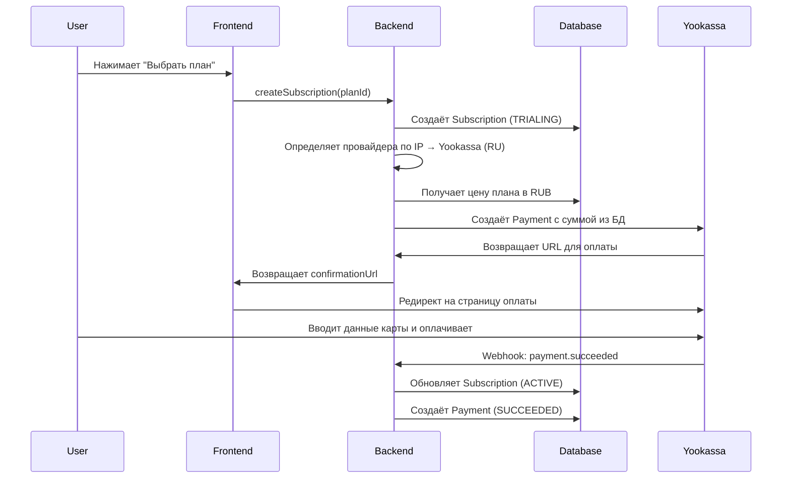

# 🎯 Yookassa Setup Guide - Пошаговая Настройка ЮKassa

**Версия:** 1.0
**Дата:** 2025-12-28
**Для проекта:** ProRab Space

---

## 📋 Что такое Yookassa

**Yookassa (ЮKassa)** - российский платёжный сервис от Сбербанка и Яндекса для приёма онлайн-платежей.

**Особенности:**
- Поддержка российских карт (Мир, Visa, MasterCard)
- Оплата через СБП (Систему Быстрых Платежей)
- Электронные кошельки (ЮMoney, QIWI и др.)
- Рассрочка и кредитование
- Низкая комиссия для РФ

**Когда используется в ProRab:**
- Пользователи из России, Беларуси, Казахстана
- Оплата в рублях (RUB)
- Автоматический выбор по IP-адресу

---

## 🚀 Шаг 1: Регистрация в Yookassa

### 1.1. Создание аккаунта

1. Перейдите на [https://yookassa.ru](https://yookassa.ru)
2. Нажмите **"Подключиться"** или **"Начать работу"**
3. Выберите тип организации:
   - **ИП** (Индивидуальный предприниматель)
   - **ООО** (Общество с ограниченной ответственностью)
   - **Самозанятый**
4. Заполните форму регистрации:
   - Email
   - Телефон
   - ИНН организации
   - Реквизиты
5. Подтвердите email и телефон

### 1.2. Верификация (Обязательно!)

⚠️ **ВАЖНО:** Для работы с реальными платежами требуется верификация!

**Потребуются документы:**
- Паспорт руководителя
- ОГРН/ОГРНИП
- Устав (для ООО)
- Свидетельство о регистрации ИП
- Банковские реквизиты

**Сроки верификации:** 1-3 рабочих дня

**Без верификации:**
- Доступен только **тестовый режим**
- Реальные платежи не работают
- Подходит для разработки

### 1.3. Тестовый режим

После регистрации вы автоматически попадёте в **тестовый режим**.

**Как проверить:**
- В личном кабинете должна быть надпись **"Тестовый магазин"**
- Переключатель **"Режим"** → **"Тестовый"**

---

## 🔑 Шаг 2: Получение API Ключей

### 2.1. Shop ID (Идентификатор магазина)

1. Войдите в [личный кабинет Yookassa](https://yookassa.ru/my)
2. Перейдите в **"Настройки"** → **"Настройки магазина"**
3. Найдите **"shopId"** или **"Идентификатор магазина"**
4. Скопируйте значение (обычно это 6-значное число)

**Пример:**
```
shopId: 123456
```

### 2.2. Secret Key (Секретный ключ)

1. В личном кабинете перейдите в **"Настройки"** → **"Настройки API"**
2. Нажмите **"Создать ключ"** или **"Сгенерировать ключ"**
3. Выберите права доступа:
   - ✅ Создание платежей
   - ✅ Получение информации о платежах
   - ✅ Возвраты
   - ✅ Webhook-уведомления
4. Скопируйте **Secret Key** (начинается с `test_` для тестового режима)

**Пример:**
```
Secret Key (test): test_AbCdEfGhIjKlMnOpQrStUvWxYz123456
Secret Key (live): live_AbCdEfGhIjKlMnOpQrStUvWxYz123456
```

⚠️ **ВАЖНО:** Секретный ключ показывается **только один раз**! Сохраните его надёжно.

### 2.3. Webhook Secret (для уведомлений)

1. В личном кабинете → **"Настройки"** → **"Уведомления"**
2. Включите **"HTTP-уведомления"**
3. Укажите **URL для уведомлений:**
   - Для локальной разработки: `http://localhost:4000/webhooks/yookassa`
   - Для продакшена: `https://ваш-домен.com/api/webhooks/yookassa`
4. Выберите события:
   - ✅ `payment.succeeded` - успешная оплата
   - ✅ `payment.canceled` - отменённая оплата
   - ✅ `payment.waiting_for_capture` - ожидание подтверждения
   - ✅ `refund.succeeded` - успешный возврат
5. (Опционально) Включите **"Подпись уведомлений"** и сохраните секрет

---

## 💳 Шаг 3: Особенности Yookassa

### 3.1. Отличие от Stripe

**Stripe:**
- Использует **Products** и **Prices** (Price IDs)
- Нужно заранее создавать цены в Dashboard
- Цены фиксированы, привязаны к продукту

**Yookassa:**
- **НЕ использует** заранее созданные цены
- Сумма платежа передаётся **напрямую** при создании
- Берёт цены из нашей базы данных

### 3.2. Как работает создание платежа

```typescript
// Stripe (использует Price ID)
const session = await stripe.checkout.sessions.create({
  line_items: [{
    price: 'price_1ABC123...',  // Заранее созданный Price ID
    quantity: 1,
  }],
  mode: 'subscription',
})

// Yookassa (использует сумму напрямую)
const payment = await yookassa.createPayment({
  amount: {
    value: '990.00',  // Сумма из нашей БД
    currency: 'RUB',
  },
  description: 'Подписка ProRab FOREMAN',
  confirmation: {
    type: 'redirect',
    return_url: 'https://...',
  },
})
```

### 3.3. Что НЕ нужно создавать

❌ **НЕ создавайте** в Yookassa Dashboard:
- Products (продукты)
- Prices (цены)
- Recurring plans (подписки)

✅ **Всё хранится** в нашей базе данных PostgreSQL:
- Таблица `Plan` - планы (LITE, FOREMAN, BRIGADE)
- Таблица `PlanPrice` - цены для каждого плана
- Система автоматически берёт нужную цену при создании платежа

---

## 🔧 Шаг 4: Настройка Environment Variables

### 4.1. Минимальная конфигурация

Откройте файл `apps/api/.env` и добавьте:

```env
# ==================== YOOKASSA CONFIGURATION ====================

# API Keys (Тестовый режим)
YOOKASSA_SHOP_ID=123456                    # Ваш Shop ID из шага 2.1
YOOKASSA_SECRET_KEY=test_ABC123...         # Ваш Secret Key из шага 2.2

# Webhook Secret (опционально)
YOOKASSA_WEBHOOK_SECRET=your_webhook_secret  # Секрет для проверки подписи (если включили)
```

### 4.2. Проверка конфигурации

После добавления переменных:

```bash
cd apps/api
pnpm dev
```

В консоли должно появиться:
```
Yookassa provider initialized successfully from environment variables
```

---

## 🧪 Шаг 5: Тестирование

### 5.1. Локальное тестирование

1. Запустите приложение:
   ```bash
   # Terminal 1
   cd apps/api && pnpm dev

   # Terminal 2
   cd apps/web && pnpm dev
   ```

2. Откройте `http://localhost:3000`
3. Перейдите в **Settings → Subscriptions**
4. Нажмите **"Выбрать план"** на любом плане
5. Должна открыться страница оплаты Yookassa

### 5.2. Тестовые карты Yookassa

**Успешная оплата:**
```
Card number: 5555 5555 5555 4477
Expiry: 12/26 (любая будущая дата)
CVC: 123
Владелец: TEST CARD
```

**Отклонённая карта:**
```
Card number: 5555 5555 5555 4444
```

**3D Secure (требует SMS-код):**
```
Card number: 4111 1111 1111 1111
SMS код в тестовом режиме: любые цифры (например, 12345)
```

**Другие методы оплаты в тесте:**
- **СБП** (Система Быстрых Платежей) - работает в тестовом режиме
- **ЮMoney** - тестовый кошелёк
- **QIWI** - тестовый кошелёк

### 5.3. Проверка webhook (локально)

⚠️ **Проблема:** Yookassa не может отправлять webhooks на `localhost`

**Решение 1: Используйте ngrok**

```bash
# Установите ngrok (если ещё не установлен)
# https://ngrok.com/download

# Запустите туннель
ngrok http 4000

# Скопируйте HTTPS URL (например: https://abc123.ngrok.io)
# Добавьте в Yookassa webhook URL:
# https://abc123.ngrok.io/webhooks/yookassa
```

**Решение 2: Временно отключите webhook verification**

В файле `apps/api/src/modules/payments/controllers/yookassa-webhook.controller.ts`:

```typescript
// Для локальной разработки можно временно отключить проверку подписи
const isValid = true; // this.yookassaProvider.verifyWebhookSignature(...)
```

⚠️ **ВАЖНО:** В продакшене ВСЕГДА включайте проверку подписи!

---

## 🗺️ Шаг 6: Как Работает Интеграция

### 6.1. Схема создания платежа



### 6.2. Выбор цены из БД

**Наша база данных:**
```sql
-- План FOREMAN
Plan {
  id: 'uuid-123',
  slug: 'foreman',
  name: 'Прораб',
  isEarlyBird: true  -- Включена скидка early bird
}

-- Цены для плана FOREMAN
PlanPrice {
  id: 'uuid-456',
  planId: 'uuid-123',
  currency: 'RUB',
  price: 990,          -- Обычная цена
  earlyBirdPrice: 690  -- Скидка early bird
}
```

**Логика выбора цены:**

```typescript
// 1. Получаем план из БД
const plan = await prisma.plan.findUnique({
  where: { id: planId },
  include: { prices: true }
})

// 2. Выбираем цену в RUB
const rubPrice = plan.prices.find(p => p.currency === 'RUB')

// 3. Определяем финальную цену
const finalPrice = plan.isEarlyBird
  ? rubPrice.earlyBirdPrice  // 690 RUB
  : rubPrice.price           // 990 RUB

// 4. Создаём платёж в Yookassa
const payment = await yookassa.createPayment({
  amount: {
    value: finalPrice.toFixed(2),  // "690.00"
    currency: 'RUB',
  },
  description: `Подписка ProRab ${plan.name}`,
  // ...
})
```

---

## 🔐 Безопасность

### Проверка подписи webhook

```typescript
// Yookassa отправляет подпись в заголовке
const signature = req.headers['x-yookassa-signature']

// Проверяем подпись
const isValid = verifyWebhookSignature(
  req.rawBody,
  signature,
  process.env.YOOKASSA_WEBHOOK_SECRET
)

if (!isValid) {
  throw new UnauthorizedException('Invalid webhook signature')
}

// Обрабатываем webhook только если подпись валидна
```

**Почему это важно:**
- Защита от поддельных уведомлений
- Гарантия, что webhook пришёл от Yookassa
- Требование PCI DSS

---

## 📊 Мониторинг

### Где смотреть платежи:

**Yookassa Dashboard:**
- **Платежи** - все транзакции
- **Аналитика** - графики и статистика
- **Выплаты** - история выплат на ваш счёт

**ProRab Admin Panel:**
- `http://localhost:3000/admin/payments` - все платежи
- `http://localhost:3000/admin/subscriptions` - все подписки

---

## 🆘 Troubleshooting

### Error: "Invalid shopId"

**Причина:** Неверный Shop ID

**Решение:**
1. Проверьте `YOOKASSA_SHOP_ID` в `.env`
2. Убедитесь, что это числовое значение (без букв)
3. Проверьте в Yookassa Dashboard → Настройки
4. Перезапустите API сервер

### Error: "Invalid API Key"

**Причина:** Неверный Secret Key

**Решение:**
1. Проверьте `YOOKASSA_SECRET_KEY` в `.env`
2. Убедитесь, что ключ начинается с `test_` (тестовый режим)
3. Возможно, ключ был удалён - создайте новый
4. Перезапустите API сервер

### Webhook не приходит

**Причина:** Yookassa не может достучаться до localhost

**Решение:**
1. Используйте ngrok для туннелирования
2. Или временно отключите webhook verification для разработки
3. В продакшене используйте настоящий HTTPS домен

### Error: "Магазин не активен"

**Причина:** Не пройдена верификация

**Решение:**
1. Завершите процесс верификации
2. Дождитесь активации (1-3 рабочих дня)
3. Или используйте тестовый режим для разработки

---

## 🚀 Production Checklist

Когда будете готовы к продакшену:

### 1. Пройти верификацию

- [ ] Подать все документы
- [ ] Дождаться проверки (1-3 дня)
- [ ] Получить статус "Магазин активен"

### 2. Переключиться на боевой режим

1. В Yookassa Dashboard переключите режим: **"Тестовый"** → **"Боевой"**
2. Создайте новый **Secret Key** для боевого режима
3. Обновите webhook URL на production домен
4. Скопируйте **Live Secret Key** (начинается с `live_`)

### 3. Обновить Environment Variables

```env
# Production .env
YOOKASSA_SHOP_ID=123456               # Тот же Shop ID
YOOKASSA_SECRET_KEY=live_ABC123...    # Live key!
YOOKASSA_WEBHOOK_SECRET=...           # Live webhook secret
```

### 4. Настроить вебхуки

1. Webhook URL должен быть HTTPS
2. Проверьте, что все события настроены
3. Протестируйте реальную карту (небольшую сумму)

### 5. Настроить комиссии

1. Согласуйте тариф с Yookassa
2. Обычная комиссия: 2.8-3.5% от суммы платежа
3. Можно договориться о льготных условиях

---

## 💰 Комиссии Yookassa

| Метод оплаты | Комиссия |
|--------------|----------|
| Банковские карты (Visa, MasterCard, Мир) | 2.8% + 10₽ |
| СБП (Система Быстрых Платежей) | 0.4-0.7% |
| ЮMoney | 2.8% |
| QIWI | 3.5% |
| WebMoney | 3.5% |

**Минимум для вывода:** 100 рублей

**Сроки зачисления:**
- На банковский счёт: T+2 (2 рабочих дня)
- На электронный кошелёк: мгновенно

---

## 📊 Сравнение: Yookassa vs Stripe

| Параметр | Yookassa | Stripe |
|----------|----------|--------|
| **Регион** | Россия, СНГ | Международный |
| **Валюты** | RUB (основная) | USD, EUR, RUB, 135+ валют |
| **Комиссия** | 2.8% + 10₽ | 2.9% + $0.30 |
| **Верификация** | Требуется (1-3 дня) | Не требуется для теста |
| **Российские карты** | ✅ Полная поддержка | ⚠️ Ограничена |
| **СБП** | ✅ Да | ❌ Нет |
| **Электронные кошельки** | ✅ ЮMoney, QIWI | ❌ Нет (для РФ) |
| **Price IDs** | ❌ Нет | ✅ Да |
| **Webhook на localhost** | ❌ Нет | ✅ Да (через CLI) |
| **Dashboard** | 🇷🇺 Русский | 🇬🇧 Английский |

---

## 📚 Полезные Ссылки

- **Yookassa Dashboard:** [https://yookassa.ru/my](https://yookassa.ru/my)
- **Документация API:** [https://yookassa.ru/developers/api](https://yookassa.ru/developers/api)
- **Тестовые карты:** [https://yookassa.ru/developers/payment-acceptance/testing-and-going-live/testing](https://yookassa.ru/developers/payment-acceptance/testing-and-going-live/testing)
- **Техподдержка:** support@yookassa.ru, +7 (495) 739-37-77

---

## ✅ Финальная Проверка

После настройки проверьте:

- [ ] Shop ID добавлен в `.env`
- [ ] Secret Key добавлен в `.env`
- [ ] Webhook Secret добавлен (если используете)
- [ ] API сервер запускается без ошибок
- [ ] Логи показывают: "Yookassa provider initialized successfully"
- [ ] Кнопка "Выбрать план" открывает страницу Yookassa
- [ ] Тестовая оплата проходит успешно
- [ ] Webhook приходит (если настроен ngrok)
- [ ] Статус подписки меняется на ACTIVE после оплаты

---

**Status:** ✅ Ready for Implementation
**Next Step:** Следуйте шагам 1-5 для настройки Yookassa

---

*Создано: 2025-12-28*
*Версия: 1.0*
