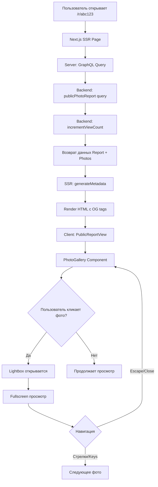
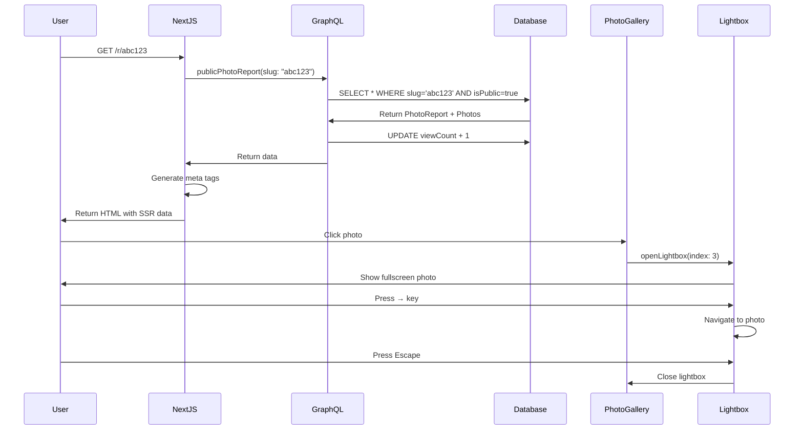

# Stage 5 Phase 4: Architecture Diagram

## System Flow



## Component Structure

```
/r/[slug]/
├── page.tsx (Server Component)
│   ├── generateMetadata() → SEO meta tags
│   └── GraphQL fetch publicPhotoReport
│       └── Auto-increment viewCount
│
└── PublicReportView.tsx (Client Component)
    ├── Header
    │   ├── Title
    │   ├── Project name & address
    │   ├── Date & view count
    │   └── Description
    │
    ├── PhotoGallery
    │   ├── Masonry Grid (1/2/3 cols)
    │   ├── Image cards with hover
    │   └── onClick → open Lightbox
    │
    ├── Lightbox
    │   ├── Fullscreen overlay
    │   ├── Navigation (prev/next)
    │   ├── Keyboard support
    │   └── Photo counter
    │
    └── Footer
        └── ProRab branding
```

## Data Flow



## File Structure

```
apps/
├── api/
│   └── src/modules/photo-reports/
│       └── photo-reports.service.ts
│           └── + incrementViewCount()
│           └── ✏️ findBySlugPublic()
│
└── web/
    ├── src/app/r/[slug]/
    │   ├── page.tsx                    [NEW]
    │   └── PublicReportView.tsx        [NEW]
    │
    └── src/packages/components/photo-reports/
        ├── PhotoGallery.tsx            [NEW]
        ├── Lightbox.tsx                [NEW]
        ├── photo-report-form.tsx       [EXISTS]
        ├── photo-uploader.tsx          [EXISTS]
        ├── photo-report-card.tsx       [EXISTS]
        └── index.ts                    [UPDATE]
```

## Tech Stack

### Backend
- **NestJS** - GraphQL resolver
- **Prisma** - Database ORM
- **PostgreSQL** - Data storage

### Frontend
- **Next.js 16** - App Router with SSR
- **React 19** - UI library
- **Framer Motion** - Animations
- **Next.js Image** - Optimized images
- **TypeScript** - Type safety

### Libraries
- `date-fns` - Date formatting
- `lucide-react` - Icons

## Key Features

### 1. SSR (Server-Side Rendering)
```typescript
// page.tsx
export async function generateMetadata({ params }: PageProps): Promise<Metadata> {
  const { data } = await client.query({
    query: PublicPhotoReportDocument,
    variables: { slug: params.slug }
  })

  return {
    title: `${data.publicPhotoReport.title} - ProRab`,
    openGraph: {
      images: [data.publicPhotoReport.photos[0].photoUrl]
    }
  }
}
```

### 2. View Counter
```typescript
// photo-reports.service.ts
async findBySlugPublic(slug: string): Promise<PhotoReport> {
  const report = await this.db.photoReport.findUnique({
    where: { slug, isPublic: true },
    include: { photos: true, project: true }
  })

  // Async increment (не ждём)
  this.incrementViewCount(report.id).catch(err => {
    this.logger.error(`Failed to increment: ${err.message}`)
  })

  return report
}
```

### 3. Responsive Gallery
```typescript
// PhotoGallery.tsx
<div className="grid grid-cols-1 sm:grid-cols-2 lg:grid-cols-3 gap-4">
  {photos.map((photo, index) => (
    <motion.div
      onClick={() => onPhotoClick(index)}
      whileHover={{ scale: 1.05 }}
    >
      <Image src={photo.thumbnailUrl} alt={photo.caption} />
    </motion.div>
  ))}
</div>
```

### 4. Keyboard Navigation
```typescript
// Lightbox.tsx
useEffect(() => {
  const handleKeyDown = (e: KeyboardEvent) => {
    if (e.key === 'Escape') onClose()
    if (e.key === 'ArrowLeft') onPrev()
    if (e.key === 'ArrowRight') onNext()
  }

  window.addEventListener('keydown', handleKeyDown)
  return () => window.removeEventListener('keydown', handleKeyDown)
}, [onClose, onPrev, onNext])
```

## SEO Optimization

### Open Graph Tags
```html
<meta property="og:title" content="Отчёт по монтажу кровли - ЖК Новая Москва" />
<meta property="og:description" content="Завершён монтаж металлочерепицы" />
<meta property="og:image" content="https://cdn.prorab.space/reports/abc123/photo1.webp" />
<meta property="og:type" content="article" />
```

### Twitter Card
```html
<meta name="twitter:card" content="summary_large_image" />
<meta name="twitter:title" content="Отчёт по монтажу кровли" />
<meta name="twitter:image" content="https://cdn.prorab.space/reports/abc123/photo1.webp" />
```

## Performance Optimization

1. **Next.js Image**
   - Автоматическая оптимизация
   - WebP format
   - Lazy loading
   - Responsive srcset

2. **SSR**
   - Данные в HTML (SEO)
   - Faster First Contentful Paint
   - No loading spinners

3. **Code Splitting**
   - Lightbox загружается только при открытии
   - Lazy imports для heavy components

4. **Caching**
   - Apollo Client cache
   - Next.js static generation (опционально)
   - CDN для изображений

## User Experience Flow

```
1. Прораб создаёт фотоотчёт
   ↓
2. Включает isPublic: true
   ↓
3. Копирует короткую ссылку: prorab.space/r/abc123
   ↓
4. Отправляет клиенту в WhatsApp/Telegram
   ↓
5. Клиент кликает ссылку
   ↓
6. Видит preview с фото в мессенджере (OG tags)
   ↓
7. Открывает страницу
   ↓
8. Видит красивую галерею
   ↓
9. Кликает на фото → Lightbox
   ↓
10. Листает фото стрелками
    ↓
11. View counter +1
    ↓
12. Прораб видит аналитику в админке
```

## Mobile Experience

### PhotoGallery на мобильных
- Single column grid (grid-cols-1)
- Touch-friendly tap targets (min 44x44px)
- Smooth scroll

### Lightbox на мобильных
- Fullscreen overlay
- Swipe для навигации (опционально в Phase 6)
- Large close/nav buttons для пальцев
- Prevent body scroll

## Analytics Tracking

```typescript
interface PhotoReportAnalytics {
  viewCount: number          // Автоматически увеличивается
  uniqueViewers?: number     // Post-MVP (через cookies/localStorage)
  averageTimeOnPage?: number // Post-MVP (через analytics.js)
  mostViewedPhoto?: number   // Post-MVP (tracking clicks)
}
```

## Future Enhancements (Phase 5)

1. **Share Buttons**
   - WhatsApp share
   - Telegram share
   - Copy link to clipboard
   - QR code generation

2. **Client Reactions**
   - Emoji reactions (👍 ❤️ 🔥)
   - Comment system
   - Rating system

3. **Download Options**
   - Download all photos as ZIP
   - Generate PDF report
   - Print-friendly version

4. **Advanced Analytics**
   - Heatmap (какие фото смотрят больше)
   - Time on page
   - Referrer tracking
   - Device/browser stats

---

**Готово к имплементации!** 🚀
