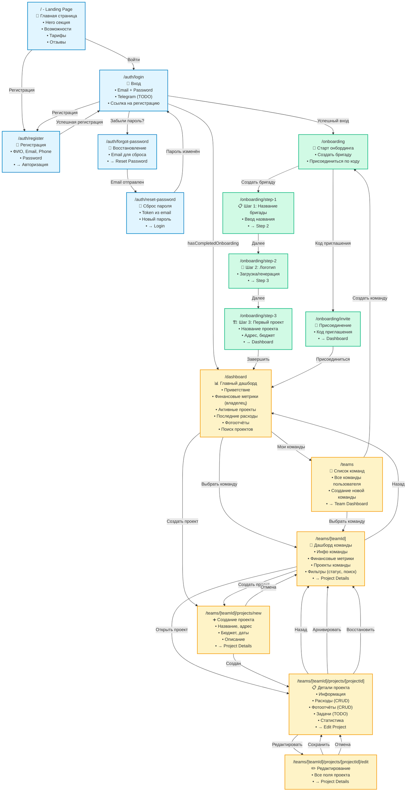

# Диаграмма структуры страниц ProRab.space

## Обзор приложения

ProRab.space — это веб-приложение для управления строительными проектами, бригадами и расходами. Приложение имеет публичные страницы (landing, авторизация) и защищенные страницы (требуют авторизации).

---

## Диаграмма навигации страниц

---

## Описание страниц и данных

### 🌐 Публичные страницы (не требуют авторизации)

#### `/` - Landing Page
**Данные:**
- Статический контент (hero, features, pricing, testimonials)
- Проверка авторизации пользователя (для показа кнопок)

**Навигация:**
- → `/auth/login` (Войти)
- → `/auth/register` (Регистрация)
- → `/dashboard` (если авторизован)

---

#### `/auth/login` - Страница входа
**Данные:**
- Форма: Email, Password
- Проверка валидации через Zod schema

**Навигация:**
- → `/auth/register` (Создать аккаунт)
- → `/auth/forgot-password` (Забыли пароль?)
- → `/onboarding` (если `!hasCompletedOnboarding`)
- → `/dashboard` (если `hasCompletedOnboarding`)

**Защита:** Публичная страница

---

#### `/auth/register` - Регистрация
**Данные:**
- Форма: FullName, Email, Phone (опционально), Password, ConfirmPassword
- GraphQL mutation: `RegisterDocument`

**Навигация:**
- → `/auth/login` (после успешной регистрации)

**Защита:** Публичная страница

---

#### `/auth/forgot-password` - Восстановление пароля
**Данные:**
- Форма: Email
- GraphQL mutation: `ForgotPasswordDocument`

**Навигация:**
- → `/auth/login` (назад)
- → `/auth/reset-password` (после отправки email)

**Защита:** Публичная страница

---

#### `/auth/reset-password` - Сброс пароля
**Данные:**
- Форма: Token (из URL), NewPassword, ConfirmPassword
- GraphQL mutation: `ResetPasswordDocument`

**Навигация:**
- → `/auth/login` (после успешного сброса)

**Защита:** Публичная страница (требует token в URL)

---

### 🔒 Защищенные страницы (требуют авторизации)

#### `/onboarding` - Старт онбординга
**Данные:**
- Выбор: создать бригаду или присоединиться по коду

**Навигация:**
- → `/onboarding/step-1` (Создать бригаду)
- → `/onboarding/invite` (Присоединиться)

**Защита:** Требует авторизации, проверка `hasCompletedOnboarding === false`

---

#### `/onboarding/step-1` - Шаг 1: Название бригады
**Данные:**
- Форма: Team Name
- Валидация названия

**Навигация:**
- → `/onboarding/step-2` (Далее)

**Защита:** Требует авторизации

---

#### `/onboarding/step-2` - Шаг 2: Логотип бригады
**Данные:**
- Загрузка файла логотипа
- Или выбор: Icon ID + Color ID (генерация)
- Preview логотипа

**Навигация:**
- → `/onboarding/step-3` (Далее)
- ← `/onboarding/step-1` (Назад)

**Защита:** Требует авторизации

---

#### `/onboarding/step-3` - Шаг 3: Первый проект
**Данные:**
- Форма: Project Name, Address, Description, Budget, StartDate, EndDate
- GraphQL mutation: `CompleteOnboardingDocument` (создает команду + проект)

**Навигация:**
- → `/dashboard` (после завершения)
- ← `/onboarding/step-2` (Назад)

**Защита:** Требует авторизации

---

#### `/onboarding/invite` - Присоединение по коду
**Данные:**
- Форма: Invite Code
- GraphQL mutation: `JoinTeamByInviteDocument` (TODO)

**Навигация:**
- → `/dashboard` (после присоединения)

**Защита:** Требует авторизации

---

#### `/dashboard` - Главный дашборд
**Данные:**
- **GraphQL Queries:**
  - `MyTeamsDocument` - список команд пользователя
  - `ProjectsByTeamDocument` - проекты выбранной команды
  - `ProjectStatsDocument` - статистика проекта (для каждого проекта)
  - `ExpensesByProjectDocument` - последние расходы (для первого проекта)
  - `ProjectPhotoReportsDocument` - последние фотоотчёты (для первого проекта)

- **Отображаемые данные:**
  - Приветствие с именем пользователя
  - Финансовые метрики (только для владельца):
    - Сумма договоров (totalBudget)
    - Потрачено (totalExpenses)
    - Прибыль/Убыток (profit)
    - Активных объектов (activeCount)
  - Список активных проектов с карточками
  - Архивные проекты (collapsible)
  - Последние расходы (сайдбар)
  - Последние фотоотчёты (сайдбар)
  - Поиск по проектам

**Навигация:**
- → `/teams` (Мои команды)
- → `/teams/[teamId]` (Выбрать команду)
- → `/teams/[teamId]/projects/new` (Создать проект)
- → `/teams/[teamId]/projects/[projectId]` (Открыть проект)

**Защита:** Требует авторизации + `hasCompletedOnboarding === true`

---

#### `/teams` - Список команд
**Данные:**
- **GraphQL Query:**
  - `MyTeamsDocument` - все команды пользователя

- **Отображаемые данные:**
  - Карточки команд с логотипами
  - Статус (Владелец/Участник)
  - Дата создания

**Навигация:**
- → `/teams/[teamId]` (Открыть команду)
- → `/onboarding` (Создать команду)
- ← `/dashboard` (Назад)

**Защита:** Требует авторизации

---

#### `/teams/[teamId]` - Дашборд команды
**Данные:**
- **GraphQL Queries:**
  - `MyTeamsDocument` - информация о команде
  - `ProjectsByTeamDocument` - проекты команды

- **Отображаемые данные:**
  - Информация о команде (название, логотип, владелец)
  - Финансовые метрики (только для владельца):
    - Сумма договоров
    - Потрачено
    - Прибыль
    - Количество активных проектов
  - Фильтры проектов:
    - По статусу (Все/Активные/Завершённые/Архив)
    - Поиск по названию/адресу
  - Сетка проектов с карточками
  - Архивные проекты (collapsible)

**Навигация:**
- → `/teams/[teamId]/projects/new` (Создать проект)
- → `/teams/[teamId]/projects/[projectId]` (Открыть проект)
- ← `/dashboard` (Назад)

**Защита:** Требует авторизации + членство в команде

---

#### `/teams/[teamId]/projects/new` - Создание проекта
**Данные:**
- **GraphQL Queries:**
  - `MyTeamsDocument` - проверка доступа к команде

- **Форма:**
  - Name (обязательно)
  - Address (опционально)
  - Description (опционально)
  - Budget (опционально)
  - ClientPhone (опционально)
  - StartDate (опционально)
  - EndDate (опционально)
  - Notes (опционально)

- **GraphQL Mutation:**
  - `CreateProjectDocument` - создание проекта

**Навигация:**
- → `/teams/[teamId]/projects/[projectId]` (после создания)
- ← `/teams/[teamId]` (Отмена)

**Защита:** Требует авторизации + членство в команде

---

#### `/teams/[teamId]/projects/[projectId]` - Детали проекта
**Данные:**
- **GraphQL Queries:**
  - `ProjectDocument` - информация о проекте
  - `ProjectStatsDocument` - статистика проекта (totalExpenses, profit, expenseCount, reportCount)
  - `ExpensesByProjectDocument` - список расходов (вкладка "Расходы")
  - `ProjectPhotoReportsDocument` - список фотоотчётов (вкладка "Фотоотчёты")
  - `MyTeamsDocument` - проверка владельца команды

- **Отображаемые данные:**
  - **Вкладка "Информация":**
    - Основная информация: название, адрес, статус, прогресс
    - Финансовые метрики (только для владельца):
      - Бюджет
      - Расходы
      - Прибыль/Убыток
      - Прогресс
    - Детали: бюджет, телефон клиента, даты, описание, заметки
  
  - **Вкладка "Расходы":**
    - Финансовый дашборд (графики, категории)
    - Форма создания/редактирования расхода
    - Список расходов с фильтрацией
    - CRUD операции над расходами
  
  - **Вкладка "Фотоотчёты":**
    - Форма создания/редактирования фотоотчёта
    - Сетка фотоотчётов с превью
    - Загрузка фото в отчёт
    - CRUD операции над фотоотчётами
  
  - **Вкладка "Задачи":**
    - Пока не реализовано (TODO)

- **GraphQL Mutations:**
  - `ArchiveProjectDocument` / `RestoreProjectDocument` - архивация/восстановление
  - `CreateExpenseDocument` / `UpdateExpenseDocument` / `DeleteExpenseDocument` - расходы
  - `CreatePhotoReportDocument` / `UpdatePhotoReportDocument` / `DeletePhotoReportDocument` - фотоотчёты
  - `UploadPhotoToReportDocument` - загрузка фото

**Навигация:**
- → `/teams/[teamId]/projects/[projectId]/edit` (Редактировать)
- ← `/teams/[teamId]` (Назад к проектам)
- → `/teams/[teamId]` (после архивации)

**Защита:** Требует авторизации + членство в команде проекта

---

#### `/teams/[teamId]/projects/[projectId]/edit` - Редактирование проекта
**Данные:**
- **GraphQL Queries:**
  - `ProjectDocument` - данные проекта для редактирования
  - `MyTeamsDocument` - проверка доступа

- **Форма:**
  - Все поля проекта (как в создании)
  - Предзаполненные значения из проекта

- **GraphQL Mutation:**
  - `UpdateProjectDocument` - обновление проекта

**Навигация:**
- → `/teams/[teamId]/projects/[projectId]` (после сохранения)
- ← `/teams/[teamId]/projects/[projectId]` (Отмена)

**Защита:** Требует авторизации + членство в команде проекта

---

## Защита маршрутов

### Middleware (`middleware.ts`)

**Публичные пути:**
- `/`
- `/auth/*`
- `/api/*`

**Защищенные пути:**
- `/onboarding/*` - требует `session_token`
- `/dashboard` - требует `session_token`
- `/teams/*` - требует `session_token`

**Логика:**
1. Если маршрут публичный → разрешить доступ
2. Если маршрут защищенный:
   - Нет `session_token` → редирект на `/auth/login?callbackUrl=...`
   - Есть `session_token` → разрешить доступ
3. Проверка `hasCompletedOnboarding` выполняется на клиенте (AuthProvider)

---

## Типы данных на страницах

### Команда (Team)
- `id`, `name`, `logoUrl`, `logoType`, `iconId`, `colorId`
- `ownerId`, `createdAt`, `updatedAt`

### Проект (Project)
- `id`, `teamId`, `name`, `address`, `description`
- `budget`, `clientPhone`, `startDate`, `endDate`
- `photoUrl`, `progress`, `status` (ACTIVE/ARCHIVED/COMPLETED)
- `notes`, `createdById`, `createdAt`, `updatedAt`

### Расход (Expense)
- `id`, `projectId`, `amount`, `category`
- `photos[]`, `comment`, `paidByClient`
- `createdById`, `createdAt`, `updatedAt`

### Фотоотчёт (PhotoReport)
- `id`, `slug`, `projectId`, `title`, `description`
- `coverPhotoUrl`, `isPublic`, `viewCount`
- `createdById`, `createdAt`, `updatedAt`, `publishedAt`
- `photos[]` - массив фотографий

### Статистика проекта (ProjectStats)
- `totalExpenses` - общая сумма расходов
- `profit` - прибыль (budget - totalExpenses)
- `expenseCount` - количество расходов
- `reportCount` - количество фотоотчётов
- `taskCount` - количество задач (TODO)

---

## Особенности навигации

1. **Умные редиректы:**
   - После логина → `/onboarding` (если не завершен) или `/dashboard`
   - После регистрации → `/auth/login`
   - Защищенные страницы без токена → `/auth/login?callbackUrl=...`

2. **Контекстные действия:**
   - FAB меню на дашборде (создать проект/расход/фотоотчёт)
   - Быстрые действия в карточках проектов
   - Контекстные меню в списках

3. **Хлебные крошки:**
   - Dashboard → Teams → Team → Project
   - Всегда есть кнопка "Назад" на страницах деталей

---

## Статусы проектов

- **ACTIVE** - Активный проект (в работе)
- **COMPLETED** - Завершённый проект (progress = 100%)
- **ARCHIVED** - Архивный проект (скрыт из основных списков)

---

## Роли пользователей

- **Владелец команды** (`ownerId === user.id`):
  - Видит финансовые метрики
  - Может создавать/редактировать проекты
  - Полный доступ ко всем функциям

- **Участник команды**:
  - Видит проекты команды
  - Может добавлять расходы и фотоотчёты
  - Не видит финансовые метрики

---

## TODO / Планируемые функции

- [ ] Страница задач (Kanban доска) - `/teams/[teamId]/projects/[projectId]` вкладка "Задачи"
- [ ] Настройки команды - `/teams/[teamId]/settings`
- [ ] Управление участниками команды
- [ ] Публичные фотоотчёты - `/public/reports/[slug]`
- [ ] Telegram авторизация
- [ ] Расчёт зарплаты бригаде
- [ ] Экспорт данных (PDF, Excel)

